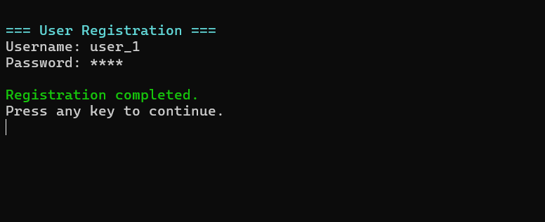
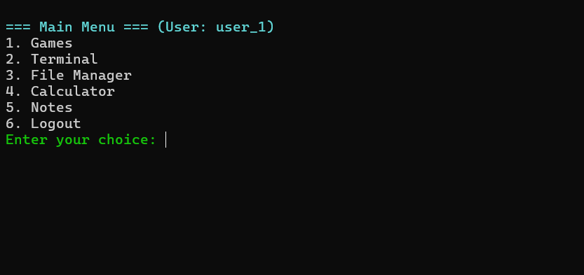
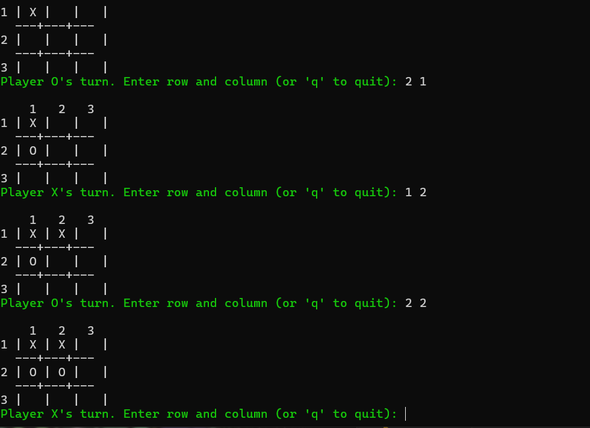
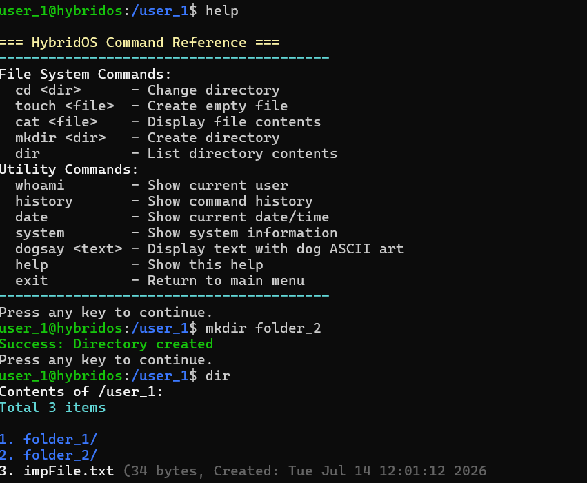
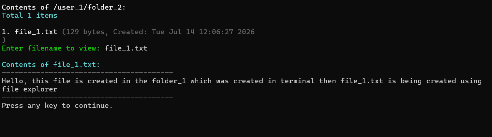
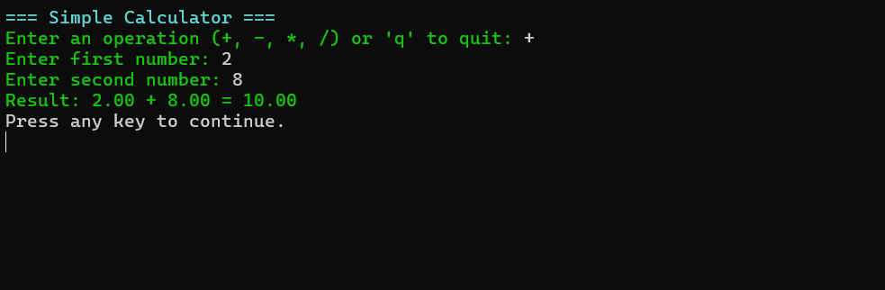

# HybridOS 🖥️

A terminal-based **Mini Operating System Simulator** built in **C** that demonstrates fundamental operating system concepts such as user management, file management, terminal commands, authentication, and utility applications.

This project was developed as an educational project to practice C programming, file handling, data structures, and command-line interface design.

---

## ✨ Features

### 👤 User Authentication
- User Registration
- User Login
- Password masking
- Individual user directories
- Persistent user storage

### 🖥️ Terminal Emulator
Supports Linux-inspired commands:

| Command | Description |
|----------|-------------|
| `help` | Display all available commands |
| `cd` | Change directory |
| `dir` | List directory contents |
| `mkdir` | Create a directory |
| `touch` | Create a file |
| `cat` | Display file contents |
| `whoami` | Show current user |
| `history` | Display command history |
| `date` | Show current system date and time |
| `system` | Display HybridOS system information |
| `dogsay` | Print text with ASCII dog |
| `clear` | Clear terminal |
| `exit` | Exit terminal |

---

### 📁 File Manager

- Create files
- Modify files
- Delete files
- View file contents

---

### 📝 Notes Application

Simple text-based note management.

- Create notes
- View notes

---

### 🧮 Calculator

Supports basic arithmetic operations:

- Addition
- Subtraction
- Multiplication
- Division

---

### 🎮 Games

#### Quiz Game

- Multiple-choice questions
- Score tracking

#### Tic Tac Toe

- Two-player gameplay
- Win and draw detection

---

## 📂 Project Structure

```
HybridOS/
│
├── main.c
├── masterFile.dat
├── README.md
│
├── UserDirectories/
│   ├── user1/
│   ├── user2/
│   └── ...
```

---

## 🛠️ Technologies Used

- C Programming Language
- Standard C Library
- File Handling
- Structures
- Dynamic Memory Concepts
- Directory Manipulation
- Console-based UI
- Windows Console API (`conio.h`, `direct.h`, `io.h`)

---

## 📚 Concepts Demonstrated

- User Authentication
- File Handling
- Command Parsing
- Virtual File System
- Directory Navigation
- Modular Programming
- ANSI Terminal Colors
- Command History
- String Manipulation
- Data Persistence
- Menu-Driven Programming

---

## 🚀 Getting Started

### Requirements

- GCC (MinGW recommended)
- Windows Operating System
- Code::Blocks / Dev-C++ / Visual Studio Code

### Compile

```bash
gcc miniOSsimulation.c -o miniOSsimulation
```

### Run

```bash
miniOSsimulation.exe
```

---

## 🖥️ Application Flow

```
Start
   │
   ▼
Welcome Screen
   │
   ▼
Register / Login
   │
   ▼
Main Menu
   ├── Games
   ├── Terminal
   ├── File Manager
   ├── Calculator
   ├── Notes
   └── Logout
```

---

## 📸 Screenshots

## Registeration



## Main Screen



## Games



## Terminal



## File Manager



## Calculator


```

---

## ⚠️ Limitations

- Windows-only implementation
- Passwords are stored in plain text (educational purpose)
- Single-process simulation
- No multitasking
- No encryption
- No networking

---

## 🔮 Future Improvements

- Password hashing
- Process management
- Multi-threading
- Text editor
- Package manager
- Better shell scripting
- File permissions
- User roles (Admin/Guest)
- Networking support
- Cross-platform compatibility (Linux/macOS)

---

## 🎯 Learning Objectives

This project was built to improve understanding of:

- C Programming
- Operating System Concepts
- File Systems
- Command-Line Interfaces
- Data Persistence
- User Authentication
- Modular Software Design

---

## 👨‍💻 Author

**Sandip Phuyal**

BIT Student | Software Engineering & AI Enthusiast

GitHub: *Add your GitHub profile link here*

---

## 📄 License

This project is licensed under the MIT License.

Feel free to use, modify, and learn from this project.
